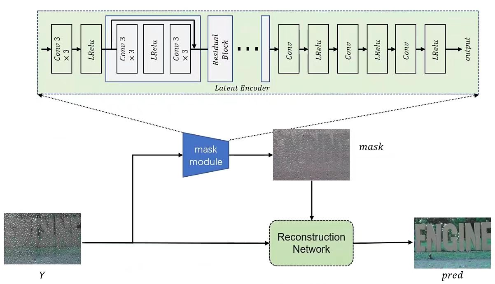
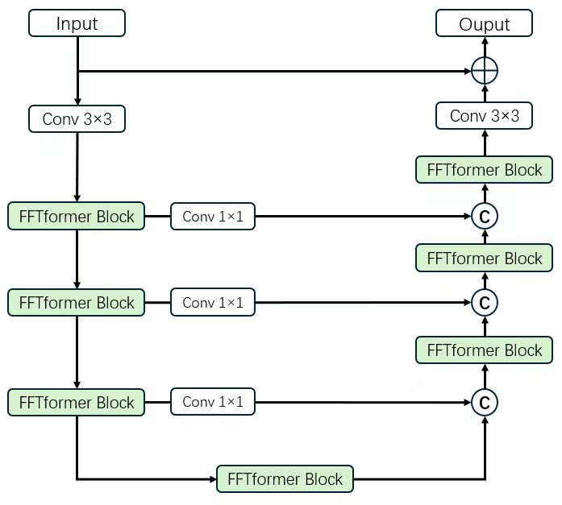

# Effcient Frequence Domain-based Transformer for High-Quality Image Deblurring - Official Pytorch Implementation

<p align="center">



This repository provides the official PyTorch implementation of the following paper:

> Abstract: In this experiment, we obtain the ground truth (GT) mask of raindrops by computing the difference between the RAinDrop image and the Blur image. For network design, we employ a multi-layer residual convolutional network to predict the mask from the input Raindrop image and compute the loss with the GT mask. At this stage, we use L1 loss for optimization. Subsequently, the predicted mask and the Raindrop image are fed into FFTformer, where the mask is concatenated with the features after each block for deraining reconstruction. At this stage, we use MSE loss for optimization.
---

## Contents

The contents of this repository are as follows:

1. [Dependencies](#Dependencies)
2. [Train](#Train)
3. [Test](#Test)


---

## Dependencies

- Python
- Pytorch (1.11)
- scikit-image
- opencv-python
- Tensorboard
- einops

---


---

## Train

bash train.sh

---

## Test

pre-trained model and submission result is available at https://drive.google.com/drive/folders/1l_R8_2UKfiQP_BYrgcQrmCBSe_ogwL41?usp=drive_link

bash test.sh

Output images will be saved in ``` results/model_name/dataset_name/``` folder.

We measured PSNR using [official RealBlur test code](https://github.com/rimchang/RealBlur#evaluation). You can get the PSNR we achieved by cloning and following the RealBlur repository.

---

## Acknowledgment: 
This code is based on the [Restormer](https://github.com/swz30/Restormer) and [NAFNet](https://github.com/megvii-research/NAFNet)

